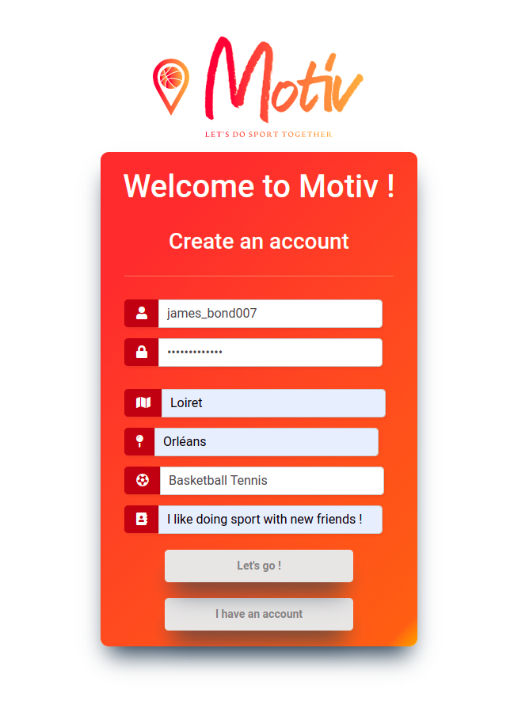
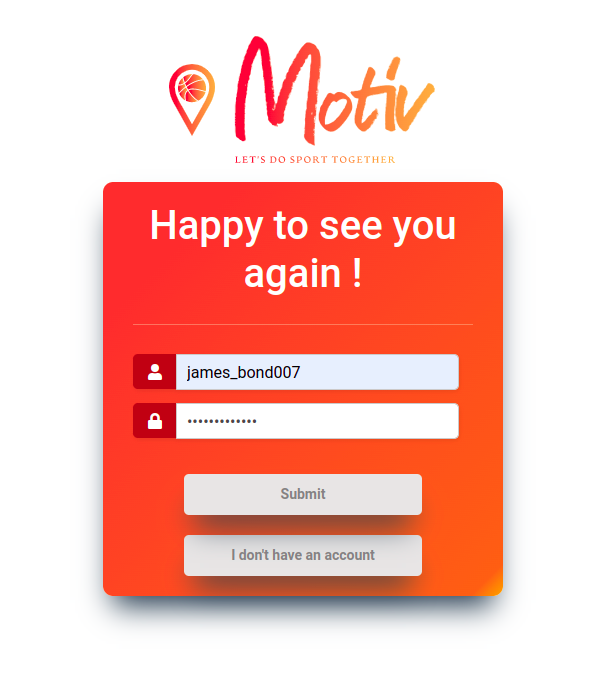
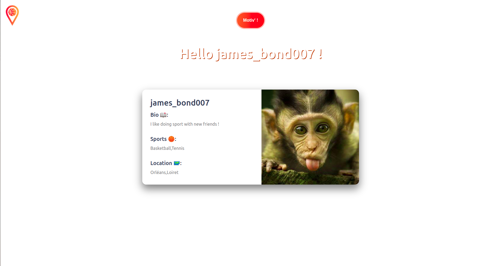
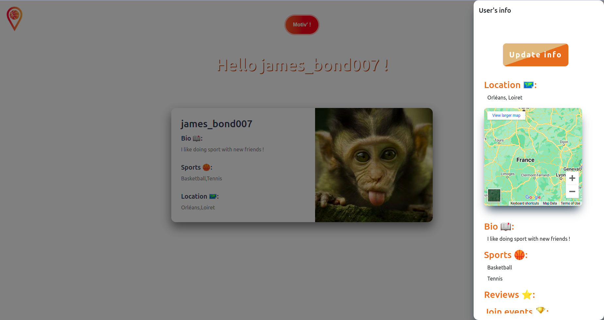
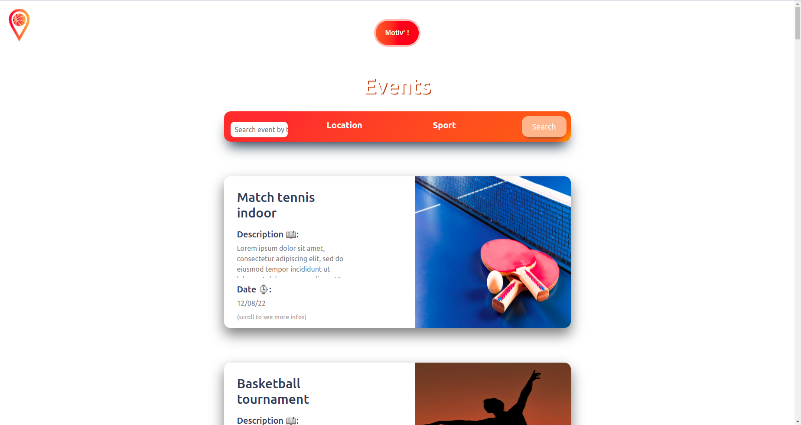
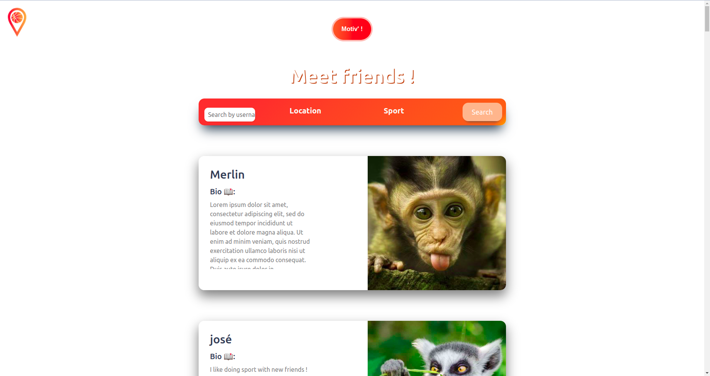

<p align="center">
  
</p>


# Portfolio project: Motiv'

<p align="center">
  
</p>

## Introduction


Hi ! My name's Rémi Marçais, I'm 19 and I'm from Laval, in France. For my portfolio project, I've created a website where you can meet people to do sport togethers and where you can join sport events. To be short, it is like a dating app, but for sport !

I got this idea in April 2022 when I wanted to go the gym. Indeed, I had nobody to go with, which discouraged me most of the time. After a few sessions, I said to my self: *"It would be so cool if I could go there with people that can then become my friend !* I thought the idea was good and would be even better if I extended the concept to every sports (Basketball, Football, Dance, Tennis...) because I think this kind of activity is better together.

So I took advantage of the portfolio project to achieve the MVP (Most Viable Product). Bacause I was alone, I played all possible roles (backend part, frontend part, blog post, presentation...).

<p align="center">
  
</p>

I had 3 weeks to do it (from 06/17/22 to 07/08/22), which was a big challenge because in addition to the MVP, I had to write a blog post, create a landing page, a demonstration (on Youtube) and of course, this beautiful README !

But it's the only challenge I've faced ! Here's is the list of all encountered challenges:

<p align="center">
  
</p>

Technical challenges:

- Create a signup/login system,  thanks to Flask-Login. I didn't know this Flask extension so I had to learn it by myself (with tutorials and documentation).
- Create the ability to update tu logged user's information
- Get and display all inforamtion related to a user or an event. To overcome this challenge, I've created a route "element/<element_id>/infos", that returns to the JSON format a dictionary containing all needed information.


Non-technical challenges:

- Covid 19
- Heat wave
- My presence at Vivatech 2022, the Europe's largest innovation fair

All these non-technical challenges wasted my precious time and forced me to adapt my plans.

But whatever, here are some links that might interest you:

- [The demo of Motiv'](https://youtu.be/DgctOQ8UmsA)
- Blog post about Motiv' (coming soon...)
- [My LinkedIn](https://www.linkedin.com/in/remi-marcais/)

<p align="center">
  
</p>


## Installations

Motiv' has been designed using ```Ubuntu 20.04.4 LTS``` and:

### Python 3.8.10
```
$ sudo apt update
$ sudo apt install python3.8
```

## mysql  Ver 8.0.29-0ubuntu0.20.04.3 (tuto [here](https://www.digitalocean.com/community/tutorials/how-to-install-mysql-on-ubuntu-20-04))

```
$ sudo apt install mysql-server
```

### Flask 2.1.2
```
$ pip install Flask
```

You can run ```$ sudo apt install python3-pip``` if ```pip``` is not already installed.

### Flask-Login

```
$ pip install flask-login
```


## Usage

### Go in the project folder

```
$ cd Portfolio_project_Motiv
```

### Start the Flask web application
```
Portfolio_project_Motiv$ python3 -m web_dynamic.motiv
* Serving Flask app 'motiv' (lazy loading)
 * Environment: production
   WARNING: This is a development server. Do not use it in a production deployment.
   Use a production WSGI server instead.
 * Debug mode: on
 * Running on all addresses (0.0.0.0)
   WARNING: This is a development server. Do not use it in a production deployment.
 * Running on http://127.0.0.1:5000
 * Running on http://172.20.10.2:5000 (Press CTRL+C to quit)
 * Restarting with stat
 * Debugger is active!
 * Debugger PIN: <PIN>
```

### Start the API
```Portfolio_project_Motiv$ python3 -m api.v1.app
 * Serving Flask app 'app' (lazy loading)
 * Environment: production
   WARNING: This is a development server. Do not use it in a production deployment.
   Use a production WSGI server instead.
 * Debug mode: on
 * Running on all addresses (0.0.0.0)
   WARNING: This is a development server. Do not use it in a production deployment.
 * Running on http://127.0.0.1:5001
 * Running on http://172.20.10.2:5001 (Press CTRL+C to quit)
 * Restarting with stat
 * Debugger is active!
 * Debugger PIN: <PIN>
```

### See the result

You can create an account:
<p align="center">
  
</p>
Log in (and log out):
<p align="center">
  
</p>
Access your profile:
<p align="center">
  
</p>
See your information and update them:
<p align="center">
  
</p>
See the available events, their info and join them:
<p align="center">
  
</p>
See the other users and their information:
<p align="center">
  
</p>

(See the [demo](https://youtu.be/DgctOQ8UmsA) for more details)

## Contribution
I ([Rémi Marçais](https://www.linkedin.com/in/remi-marcais/)) am the only contributor.


## Related projects

Here are the projects I did that help me creating Motiv':

- [Airbnb clone](https://github.com/rmarcais/AirBnB_clone_v4)
- [Python/JavaScript skills](https://github.com/rmarcais/holbertonschool-higher_level_programming)


## License

This project is not opensource. Please don't use this code for any purpose, in threat of lawsuit.

<p align="center">
  
</p>
